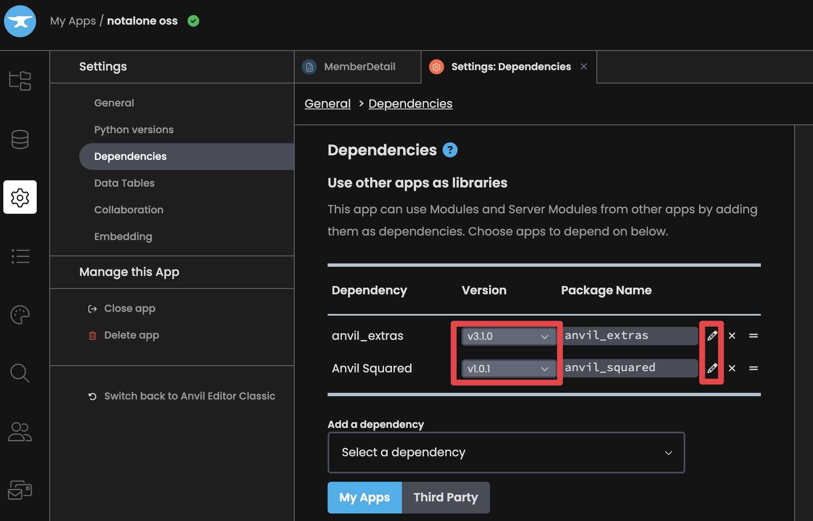
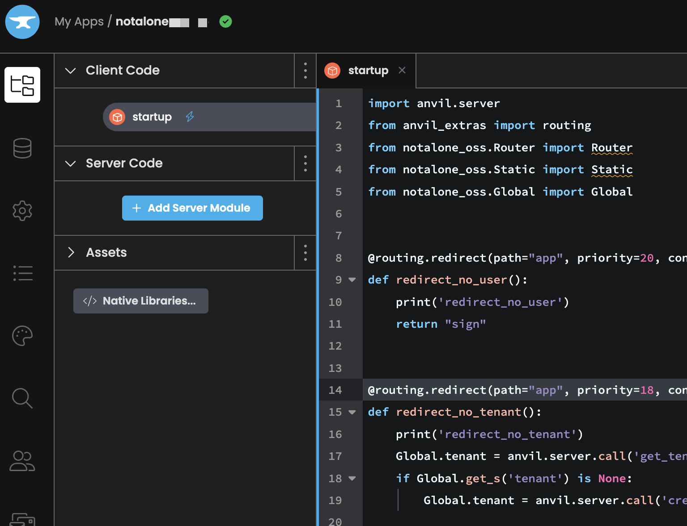
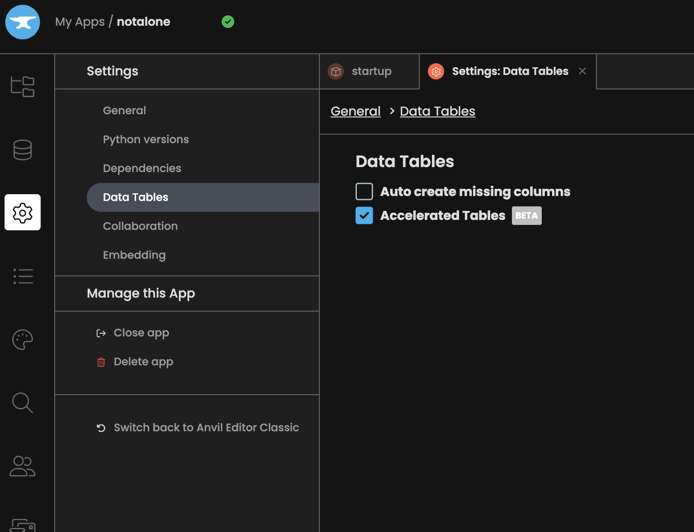
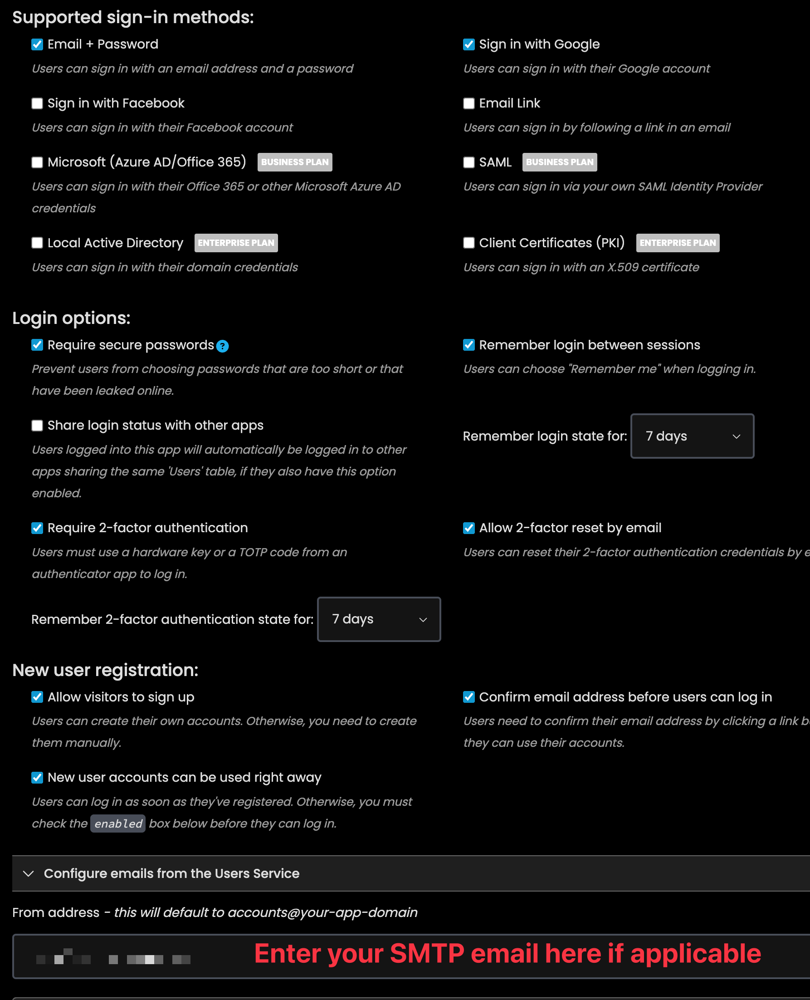
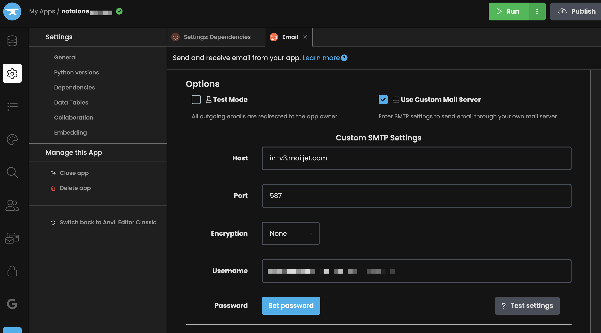

# Getting Started Guide

This guide will help you set up your development environment for working with the Not Alone app. The app is built using [Anvil's web framework](https://anvil.works) and integrates with several external services.

## Prerequisites

Before starting, ensure you have:

- A GitHub account
- A PayPal business account
- A DigitalOcean account (for Discourse hosting)
- A Mailjet account (for Discourse emails)
- Basic knowledge of Python and web development

## 1. Set up Mailjet and Discourse
See [Discourse Setup](discourse_setup.md)

## 2. Set up PayPal
See [PayPal Setup](paypal_setup.md)

## 3. Anvil Setup

1. Visit [anvil.works](https://anvil.works)
2. Sign up for a free account
3. Choose the "Free" plan (sufficient for development)

## 4. Repository Setup

You have two options for setting up the repository, depending on your needs:

### Option A: Fork the Repository (For Contributing Changes)

If you plan to contribute changes back to the main project:

1. Fork the Not Alone repository:
    - Visit https://github.com/yahiakala/notalone-app
    - Click "Fork" button
    - Go to your Anvil.works account and click "Clone from GitHub" under the "Create a new app" section
    - Enter the URL to your forked repo, and authenticate with your GitHub account
    - Click "Clone App"

### Option B: Clone the Repository (For Using as Is)

If you just want to use the app without contributing changes:

1. Clone the Not Alone repository directly:
    - Go to your Anvil.works account
    - Click "Clone from GitHub" under the "Create a new app" section
    - Enter https://github.com/yahiakala/notalone-app
    - Click "Clone App"

### Setting up Dependencies

After either option above:

- Go to Settings > Dependencies
- Use the pencil icon to edit your dependencies, but do not change the versions
- Make sure the anvil_extras dependency is set to point to a third party dependency with dependency ID C6ZZPAPN4YYF5NVJ. [See here for more info](https://github.com/anvilistas/anvil-extras). Use the pencil icon. Do not change the tag.
- Make sure the anvil_squared dependency is set to point to a third party dependency with dependency ID KDKDM3MG6IQHC2FK. Use the pencil icon. Do not change the tag.

## 5. Creating a New App with Not Alone as a Dependency

Create your own app that uses Not Alone as a dependency. You have to do this because you want to eventually edit the SMTP settings and other information without editing the open source app.

Create a new Anvil app:

- Go to your Anvil.works dashboard
- Click "Create New App"
- Choose a blank template

Add Not Alone as a dependency:

- Go to Settings > Dependencies
- Click "Add Dependency"
- Choose the notalone app

Copy the startup.py file

Set your settings for accelerated tables, user settings, and smtp settings:

## Additional Resources

- [Anvil Documentation](https://anvil.works/docs)
- [PayPal Developer Docs](https://developer.paypal.com/docs)
- [Discourse API Guide](https://docs.discourse.org)
- Project-specific docs in `/docs` directory
